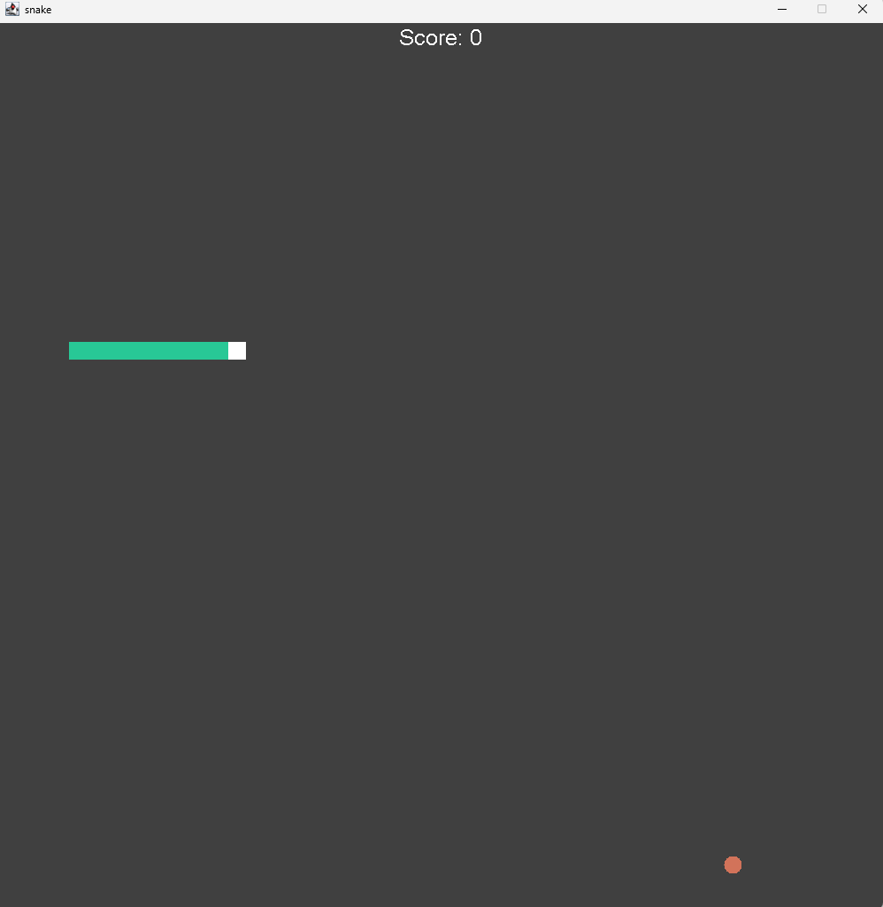

# 🐍 Classic Snake Game (Java)

A simple and classic Snake Game built using Java and Swing GUI components. The player controls the snake to eat food, grows in size, and avoids colliding with itself or walls.

## 🎮 Features

- Classic snake gameplay with smooth movement
- Score tracking
- Game over detection
- Keyboard input for snake control
- Built using Java Swing 

 'Preview')

## 🚀 Getting Started
Just download and play

### Prerequisites

- Java Development Kit (JDK 8 or higher)
- An IDE (like IntelliJ IDEA, Eclipse) or a terminal to compile and run the game

### How to Run

1. **Clone or Download the Repository**
   ```bash
   git clone https://github.com/yourusername/snake-game-java.git
   cd snake-game-java
